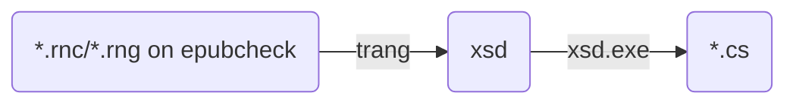
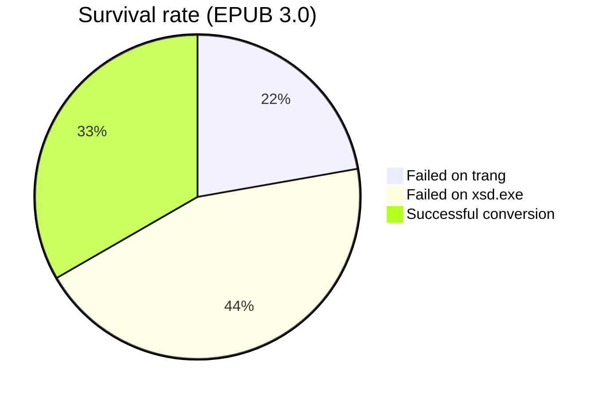
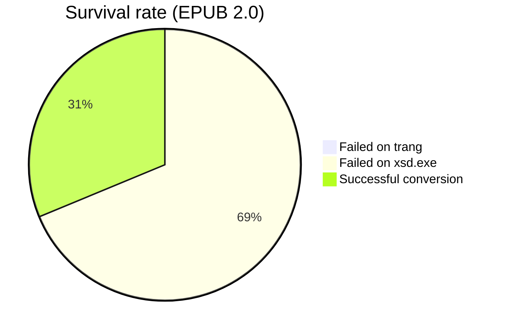

# EpubLibrary
This repository contains:

| Title | Path | Detail |
| -- | -- | -- |
| XML Schema files | [xsd](xsd) | Converted from [epubcheck](https://github.com/w3c/epubcheck/tree/main/src/main/resources/com/adobe/epubcheck/schema) using [trang](https://relaxng.org/jclark/trang.html) |
| C# files for serialization | [CS](CS) | Generated from XML Schema files using [xsd.exe](https://docs.microsoft.com/dotnet/standard/serialization/xml-schema-definition-tool-xsd-exe) |
| GitHub Actions yamls | [.github](.github/workflows) | |
| A dotnet library | | In the future. |

